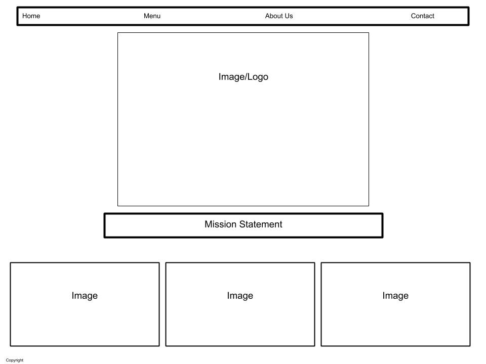

## HTML Ch. 1 - Structure

A core tenant of coding in HTML is understanding how to use tags.  As described by Jon Duckett, 
> "Tags act like containers.  They Tell you something about the information that lies between their opeining and closing tags."

Therefore to build your website successfully you need to understand how to use tags to organize and customize your content.  Below are some of the basic HTML tags we use to get started:

|Tag|Description|
|:-:|--:|
|`<html></html>`|Indicates that the content is HTML code|
|`<head></head>`|Indicates that the contents contain information *about* the page but will not be shown inside the browser|
|`<title></title>`|Indicates that the contents are the *title* of the page, which will be shown above the URL.  This tag belongs inside the `<head></head>` tags
|`<body></body>`|Indicates that the contents should be shown inside the main browser|
|`<h1></h1>`|Indicates that the contents are a main heading.  H2 - H6 can be used in a similar way for subheadings|
|`

`|Indicates that the contents are a paragraph|

---

## HTML Ch. 8 - Extra Markup

Along with tags, you as a web designer can utilize attributes such as id and class - these are ways of adding additional information to tags so that later when it comes time to style your page you have a lot more control around what you're doing.  The principle difference between the two is that

* an ID is unique!
* a class can be shared and applied many times throughout your project.

|Tag / Term|Description|
|:-:|--:|
|`<!-- -->`|Comment - allows you to make notes for yourself and others working with the code - anything within this tag will *not* display in the browser|
|Block Element|Element that will always appear to start on a new line.  Examples include `<h1>`, `
`, `<ul>` and `<li>`.|
|Inline Element|Element that will always appear to continue on the same line as neighboring elements.  Examples include `<a>`, `<b>`, `<em>` and ``.|
|`

`|Indicates that the contents are all related - this is broad category, and sometimes can be replaced by a more specific tag|
|``|Inline equivalent of `
`|
|`<iframe></iframe>`|Element that allows an inline frame within which another page can be displayed.|
|`<meta>`|Element within the `<head>` that contains information about the web page, such as keywords or a description that can be used by search engines.|

---

## HTML Ch. 17 - HTML5 Layout

With the introduction of HTML5, many new tags were added to further organize internal content of webpages, such as: 

|Tag|Description|
|:-:|--:|
|`<header></header>`|Indicates the header for the webpage OR for a section of that page.|
|`<footer></footer>`|Indicates the footer for the webpage OR for a section of that page.|
|`<nav></nav>`|Indicates the navigation bar|
|`<article></article>`|Indicates a section that could stand alone, such as an article or comment.  Article elements can be nested within other article elements.|
|`<aside></aside>`|Within an article element, indicates information related to but not essential to the article.  Outside of that context, indicates content related to the entire page.|
|`<section></section>`|Groups related content together.|
|`<hgroup></hgroup>`|Heading Groups are used to group one or more heading elements (`<h1> - <h6>`) together so that they can be treated as a single heading.|
|`<figure></figure>`|Can contain any content that is referenced from the main flow of an article.  Should also include a `<figcaption>` element to provide a text description.|

---

## HTML Ch. 18 - Process & Design

There are several things to consider before beginning to build out a webpage.  Before anything else, you must have in mind what it is that you *want* to build!  That means considering the following:

* Who are you building the site for?
* What is the purpose of the site as far as they are concerned?
* Who are they hoping will interact with the site?
* How will those users interact with the site?
* How often will they interact with the site?

Questions like this can ensure that all parties involved are on the same page before diving into the nitty gritty of web design.

Once we think we know these answers, it's time to build out a site map and wireframe.  The site map allows you to plan the structure of your site, while the wireframe is at it's core a bare bones representation of what kinds of information will be on each page and how that information will be organized.  We're not talking fonts and color swatches yet - we're not even talking content so much as broad categories sorted into a diagram that represents the skeleton or *wireframe* of the website that will be.

While building the wireframe it can be helpful to start thinking about design elements that will help to bring the overall concept of the website together, such as what information may need to pop - that's where you'll want to implement a thoughtful use of font size, color and style to bring your vision to life.

---

## JavaScript Introduction & Ch. 1 - The ABC of Programming

> JavaScript allows you to make web pages more interactive by accessing and modifying the content and markup used in a web page while it is being viewed in the browser.

In the simplest terms, JavaScript is a series of instructions (called a *script*) that a computer can follow to achieve the desired goal - much like a recipe.  While scripts may end up quite complex, each individual step of the script will be a relatively simple function.

In order to successfully write a script, one must learn the correct vocabulary and syntax to effectively communicate with a computer that will be unable to interpret what is being asked of it.

When adding JavaScript to a project, it is good form to keep JS code in it's own file with a .js extension and then use the `<script>` element within your HTML to reference the JS code.

---
[Home](https://jchinzi.github.io/reading-notes/)
