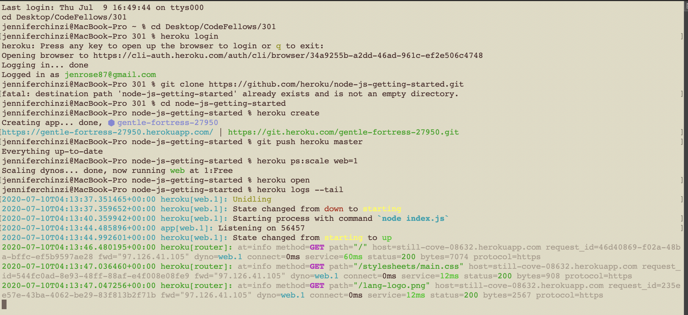

## [Getting Started on Heroku with Node.js](https://devcenter.heroku.com/articles/getting-started-with-nodejs)

Heroku is a cloud application platform that enables developers to build, run and operate applications entirely in the cloud.  The website linked above assists new users in installing and setting up Heroku locally.

---
[Home](https://jchinzi.github.io/reading-notes/)